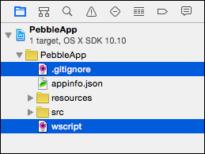
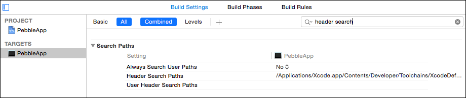

# Pebcode
How to set up Xcode for [Pebble](https://getpebble.com) development.

## Prerequisites
Before you continue, please make sure you have...

* The latest version of the Pebble SDK, installed as per [these instructions](http://developer.getpebble.com/sdk/install/mac)
* Xcode 6.1.1, which can be found on the [Mac App Store](https://itunes.apple.com/gb/app/xcode/id497799835?mt=12)

## Xcode, Meet Pebble

Open Xcode, and select **File\New\Project**. Then choose the **OS X\Application\Command Line Tool** template:

Enter the details of your app, make sure to change **Language** to **C**, and then click **Next**:

Choose somewhere on disk to create the project, and then click **Create**.

When Xcode has finished doing it’s thing, select all the groups in the Project Navigator:

And hit backspace to delete them. When prompted, choose **Move to Trash**:

Next, navigate to your project’s folder using Finder and delete the empty folder that’s sitting alongside the Xcode project file:

Fire up Terminal, `cd` into the folder containing the Xcode project file, and use `pebble` to create a new Pebble project, using the same name as the Xcode project:

Back in Xcode, right click on the project in the Project Navigator and select **Add Files to “Project Name”** :

In the file dialog, select the folder you created earlier using the `pebble` command:

In the Project Navigator select both the **.gitignore** and **wscript** files:

And hit backspace. But this time choose **Remove References** when prompted.

Next up, you need to tell Xcode where to find the headers for the Pebble SDK.

Select the target for your project, and then open the **Build Settings** pane. Enter **header search** in the search box:

Double-click on **Header Search Paths** and then click the **+** button to add a new entry. Enter the **full** path to the **include** directory inside the Pebble SDK folder, and change **non-recursive** to **recursive**:

> In case it’s not clear in the screenshot, the full path I used was **/Users/micpringle/Pebble/PebbleSDK-3.0-dp1/Pebble/include**, but obviously your path will be different.

