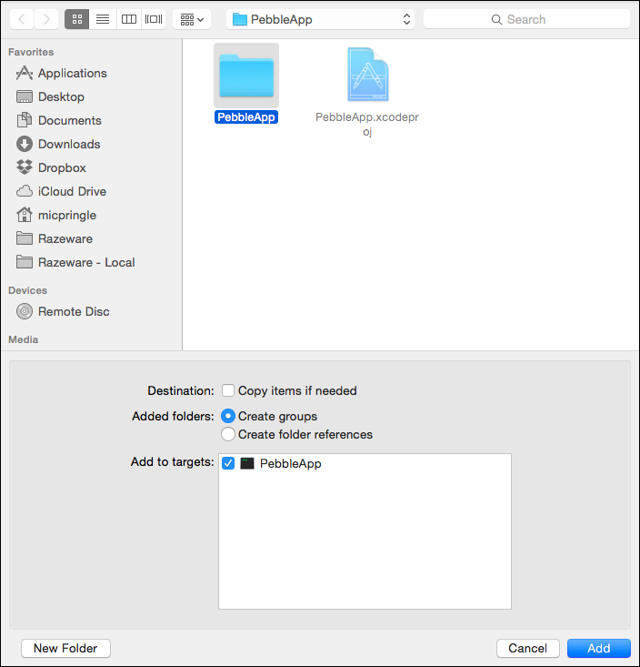
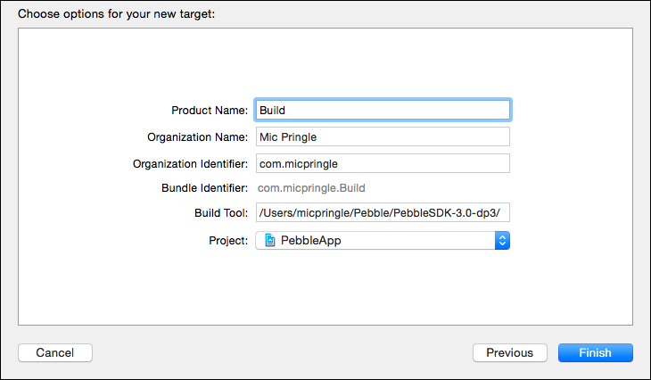

# Pebcode
How to set up Xcode for [Pebble](https://getpebble.com) development.

**Note:** These instructions are based purely on trial and error. If you know of a better way to achieve one or more of the steps below then please do contribute by way of a pull request.

#### TODO
1. Figure out how to install the built app into the emulator

## Prerequisites
Before you continue, please make sure you have...

* The latest version of the Pebble SDK, installed as per [these instructions](http://developer.getpebble.com/sdk/install/mac)
* Xcode 6.1.1, which can be found on the [Mac App Store](https://itunes.apple.com/gb/app/xcode/id497799835?mt=12)

## Xcode, Meet Pebble

Open Xcode, and select **File\New\Project**. Then choose the **OS X\Application\Command Line Tool** template:

Enter the details of your app, make sure to change **Language** to **C**, and then click **Next**:

Choose somewhere on disk to store the project, and then click **Create**.

When Xcode has finished doing it’s thing, select all the groups in the Project navigator:

And hit backspace to delete them. When prompted, choose **Move to Trash**:

Next, navigate to your project’s folder using Finder and delete the empty folder that’s sitting alongside the Xcode project file:

Fire up Terminal, `cd` into the folder containing the Xcode project file, and use `pebble` to create a new Pebble project, using the same name as the Xcode project:

Back in Xcode, right click on the project in the Project navigator and select **Add Files to “Project Name”** :

In the file dialog, select the folder you created earlier using the `pebble` command:

In the Project navigator select both the **.gitignore** and **wscript** files:

And hit backspace. But this time choose **Remove References** when prompted.

Next up, you need to tell Xcode where to find the headers for the Pebble SDK.

Select the target for your project, and then open the **Build Settings** pane. Enter **header search** in the search box:

Double-click on **Header Search Paths** and then click the **+** button to add a new entry. Enter the *full* path to the **include** directory inside the Pebble SDK folder, and change **non-recursive** to **recursive**:

`/Users/micpringle/Pebble/PebbleSDK-3.0-dp3/Pebble/include`

You might find a new _product_ appears in the Project navigator after making this change:

Go ahead and delete it! This seems to happen whenever you make changes to the target’s Build Settings, but since you’ll never build that target it’s safe to remove the _product_.

Next, select **Editor\Add Target**. Then choose the **OS X\Other\External Build System** template:

Name the product **Build**, set **Build Tool** to the *full* path of the `pebble` executable found in the Pebble SDK, and then click **Finish**:

`/Users/micpringle/Pebble/PebbleSDK-3.0-dp3/bin/pebble`

Select the new **Build** target and open the **Info** pane. Set **Arguments** to **build**, **Directory** to the directory of your Pebble app, and uncheck **Pass build settings in environment**:

The final step is to delete the scheme that will build and run the original OS X command line tool.

Select **Product\Schemes\Manage Schemes**. In the Scheme Manager highlight the original scheme and then click the **-** button:

Confirm the deletion when prompted, and then click **Close** to save your changes.

And that’s all there is too it. 

## But Why?

You might be thinking there’s a lot of hoops to jump through here, so what’s value in doing so? Well, once setup you get the following:

### Syntax Highlighting

### Code Completion

### Build Support

You can use ⌘+b to build your Pebble app, and you can even see the output from the build in the Report navigator.

### Quick Help

I :heart: Pebble’s SDK developers for making sure the headers are so well documented.

### Syntax Checking

This comes in really useful if you’ve recently moved to [Swift](https://developer.apple.com/swift/) and have therefore completely forgot about the need for semi-colons :smirk:

